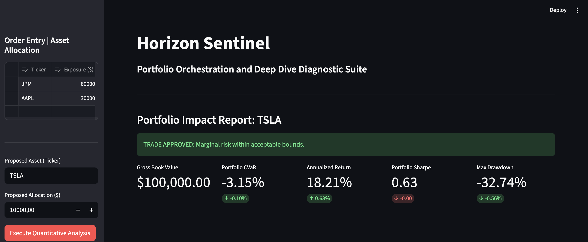
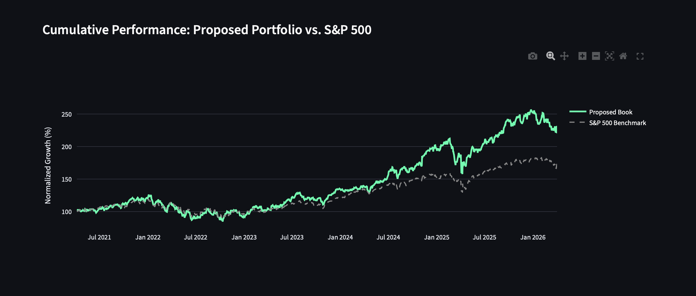
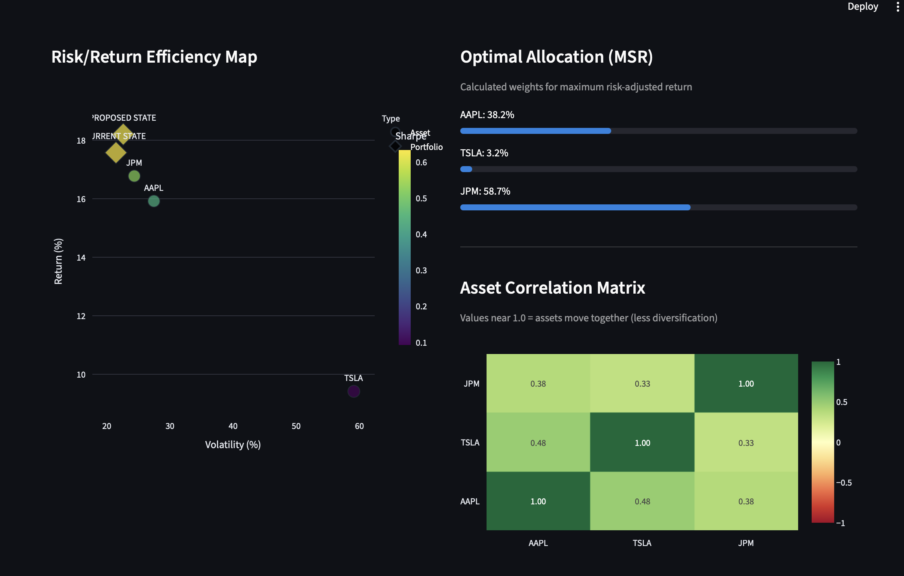
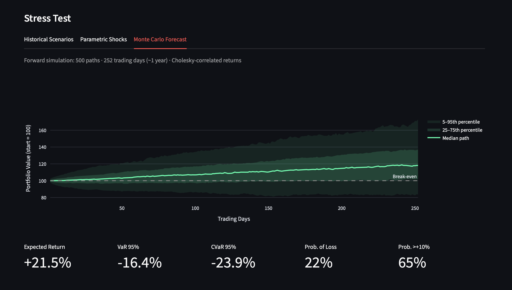
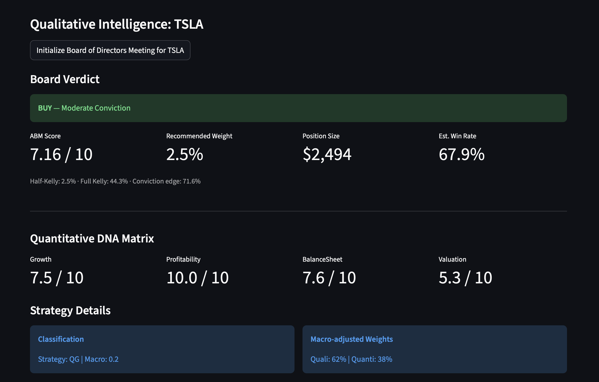

# Horizon Sentinel
**Portfolio Orchestration and Deep Dive Diagnostic Suite**

Horizon Sentinel is a deterministic, multi-agent financial architecture for institutional-grade portfolio analysis. It serves as a strict quantitative and qualitative filter for asset allocation, ensuring capital is only deployed after passing rigorous risk, efficiency, and heuristic evaluations.

---

## Dashboard Preview

**1 — Portfolio Impact Report**


**2 — Cumulative Performance vs. S&P 500**


**3 — Risk/Return Efficiency Map & Correlation Matrix**


**4 — Monte Carlo Stress Test**


**5 — Board of Directors Verdict & ABM Score**


---

## System Architecture

The system is strictly compartmentalized across five layers to ensure data hygiene, modularity, and separation of concerns.

```
sentinel_ui.py  (Streamlit Dashboard)
      │
      ├── DataNexus          (nexus_core.py)      — Single source of truth for market data
      ├── RiskGatekeeper     (risk_core.py)        — CVaR engine + veto logic
      ├── QuantModeler       (quant_core.py)       — Sharpe optimizer, Monte Carlo, stress test
      ├── ActiveBusinessModel(valuation_core.py)   — ABM V6.0 scoring engine
      └── Agent Board        (agent_core.py)       — LLM-powered qualitative intelligence
```

### 1. Data Ingestion — Data Nexus
**`nexus_core.py`**: The single source of truth for market data. Handles all API requests for price matrices and fundamental metrics via `yfinance`, preventing redundant network calls and maintaining data consistency across all modules.

### 2. Deterministic Engines — Risk & Quantitative Logic
**`risk_core.py`**: Calculates absolute and marginal Conditional Value at Risk (CVaR) using historical simulation. Enforces hard portfolio constraints and holds veto power over trades that breach the maximum loss threshold.

**`quant_core.py`**: Solves for the Maximum Sharpe Ratio (MSR) allocation using SLSQP optimization. Generates historical backtests, asset correlation matrices, parametric stress tests, and 500-path Monte Carlo forward simulations using Cholesky-decomposed correlated returns.

**`valuation_core.py`**: The Active Business Model (ABM V6.0) — a dynamic diagnostic engine that scores assets across four quantitative pillars (Growth, Profitability, Balance Sheet, Valuation) with sector-specific logic (ROE/CET1 for Financials vs. ROIC/Debt for Technology). Integrates a Kelly Criterion position sizer that translates ABM scores into concrete allocation recommendations.

### 3. Heuristic Intelligence — Agent Hub
**`agent_core.py`**: A four-agent evaluation board powered by Groq (llama-3.3-70b). Distinct agents handle macro regime analysis, qualitative company assessment, risk scanning, and forward financial estimates. Automatically falls back to conservative defaults if no API key is configured.

### 4. User Interface
**`sentinel_ui.py`**: The Streamlit execution dashboard. Isolates the interaction layer from data and logic layers. Uses session state to prevent redundant recalculation on UI interactions.

---

## Features

- **Pre/Post Trade Impact** — Marginal CVaR, Sharpe Ratio delta, and Max Drawdown comparison before and after a proposed allocation
- **Risk/Return Efficiency Map** — Scatter plot of current vs. proposed portfolio state against individual asset profiles
- **Asset Correlation Matrix** — Heatmap of pairwise daily return correlations to identify diversification gaps
- **Stress Test Engine** — Historical crisis replay (Covid, Rate Shock) + parametric shocks calibrated to GFC/Dot-com magnitudes, always available regardless of data window
- **Monte Carlo Forecast** — 500 Cholesky-correlated forward paths with fan chart, VaR, CVaR, and probability of loss
- **LLM Board Meeting** — AI agents deliver qualitative scores fed into the ABM engine for a final scored diagnosis
- **Kelly Position Sizing** — Half-Kelly allocation recommendation constrained by CVaR budget and concentration limits

---

## Installation & Usage

### 1. Clone the Repository
```bash
git clone https://github.com/YOUR_USERNAME/Hedge_Fund_Project.git
cd Hedge_Fund_Project
```

### 2. Install Dependencies
```bash
pip install -r requirements.txt
```

### 3. Configure Environment Variables
Create a `.env` file in the project root:
```
GROQ_API_KEY=your_groq_api_key_here
```
Get a free API key at [console.groq.com](https://console.groq.com).
The application runs in **Simulation Mode** automatically if no key is provided.

### 4. Launch the Dashboard
```bash
streamlit run sentinel_ui.py
```

### 5. Run Tests
```bash
pytest tests/test_engines.py -v
```

---

## Project Structure
```
Hedge_Fund_Project/
├── sentinel_ui.py                  # Streamlit dashboard (entry point)
├── research_cli.py                 # CLI batch analysis runner
├── requirements.txt
├── .env.example
├── assets/
│   └── dashboard_preview.png
├── tests/
│   └── test_engines.py
└── engines/
    ├── data_nexus/
    │   └── nexus_core.py
    ├── valuation_vault/
    │   └── valuation_core.py
    └── agent_hub/
        ├── agent_core.py
        ├── risk_manager/
        │   └── risk_core.py
        └── quant_manager/
            └── quant_core.py
```